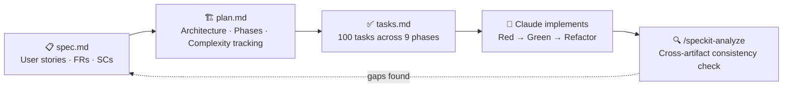
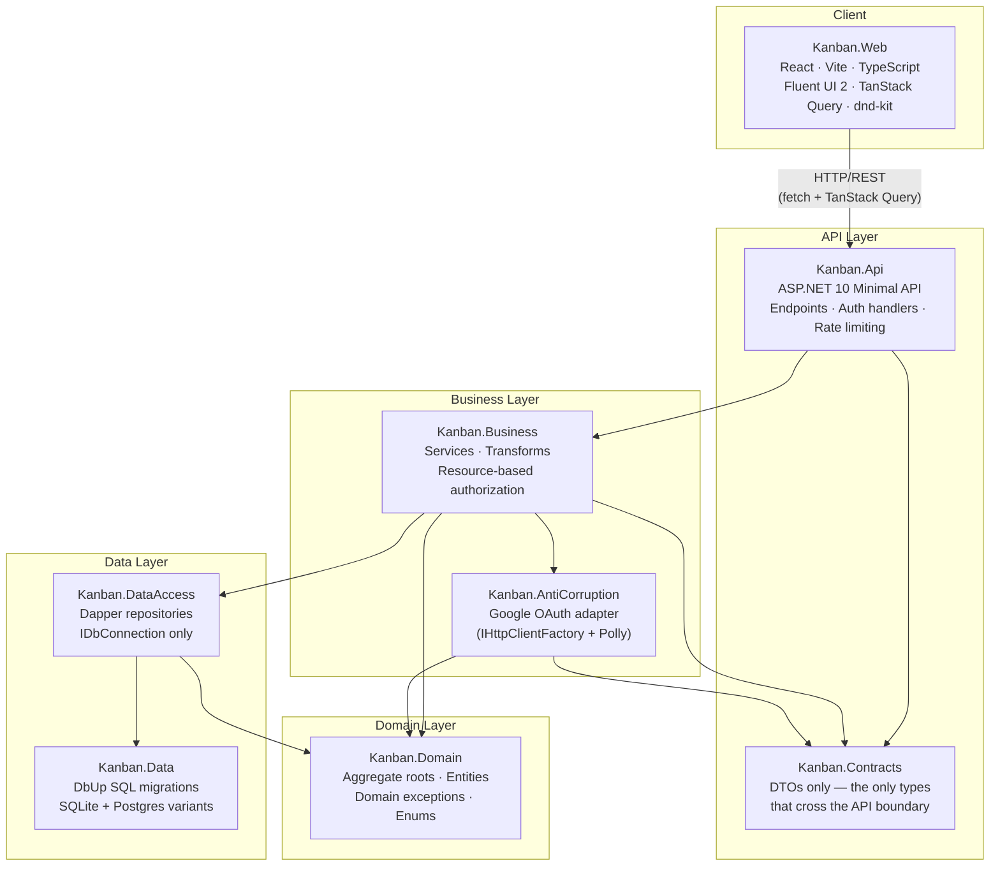
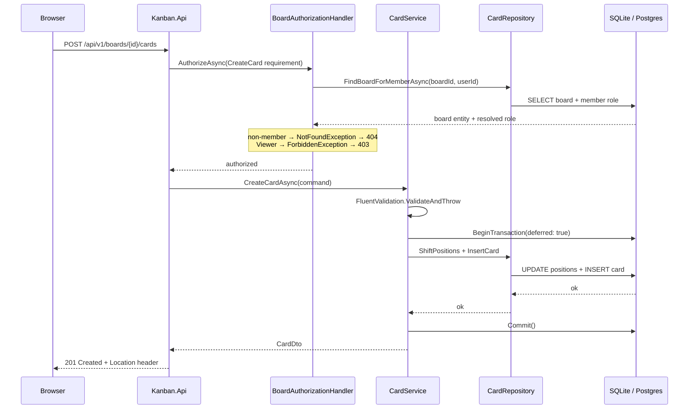
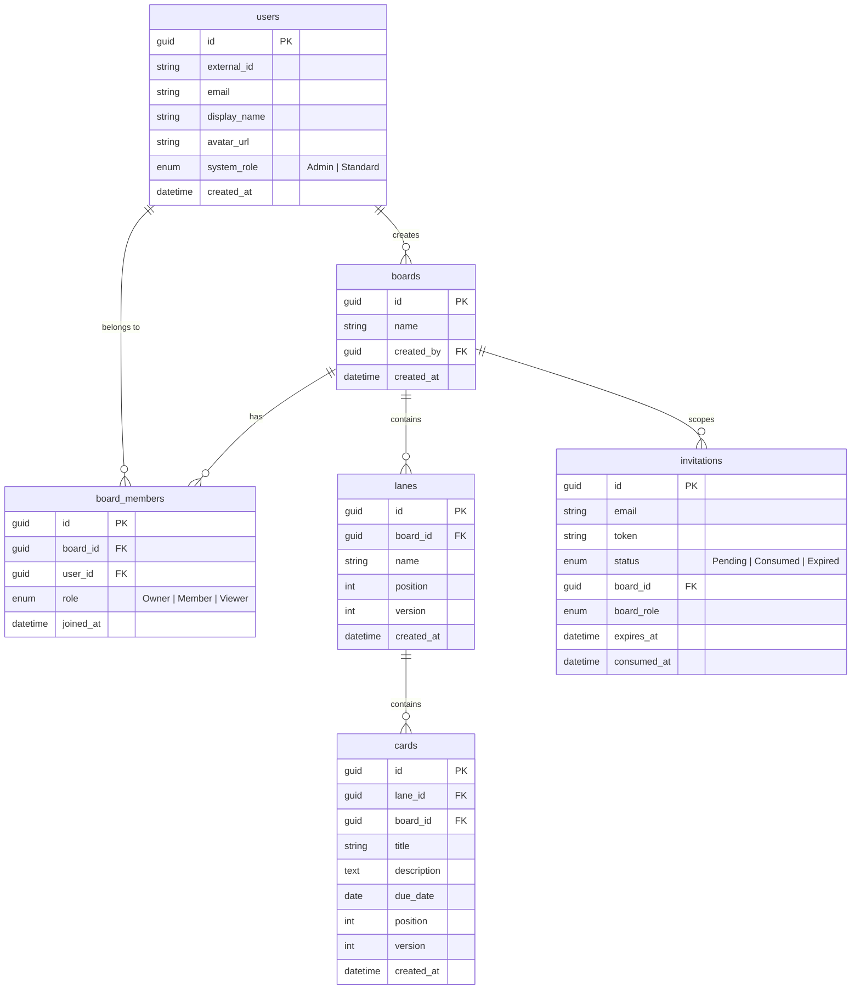
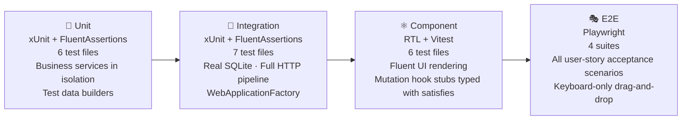

# Kanban

A production-quality board-based task management application demonstrating spec-first, constitution-governed agentic development with Claude as the primary code author.

**Author:** Tyler Bithell · [CV](./Tyler_Bithell_CV_06122026.pdf)

---

## Application Materials

| Artifact | Location |
|----------|----------|
| CV | [cv.pdf](./Tyler_Bithell_CV_06122026.pdf) |
| AI session logs | [session-logs/](./session-logs/)  |
| Feature specification | [specs/002-kanban-core/spec.md](specs/002-kanban-core/spec.md) |
| Implementation plan | [specs/002-kanban-core/plan.md](specs/002-kanban-core/plan.md) |
| Task breakdown (100 tasks) | [specs/002-kanban-core/tasks.md](specs/002-kanban-core/tasks.md) |
| Governing constitution | [.specify/memory/constitution.md](.specify/memory/constitution.md) |

---

## How This Was Built

This project was developed using a spec-first, constitution-governed agentic workflow — Claude functioned as the primary code author throughout, directed by written specifications, an architectural constitution, and a structured task breakdown. No line of implementation code was written by hand; every commit was authored by Claude under explicit governance.

The workflow enforced:

- **Spec before code** — functional requirements, success criteria, and user stories written and approved before implementation began
- **TDD throughout** — every task committed a failing test before the passing implementation; the Red-Green-Refactor cycle is verifiable in git history
- **Constitution as law** — a 1,800-line governing document covering SOLID, security, observability, error handling, database portability, multi-tenancy readiness, and containerization readiness; no principle was waived without a documented rationale
- **Four test layers** — unit, integration (real SQLite), React Testing Library component tests, and Playwright end-to-end tests; coverage ≥ 90% required before any phase closed



---

## Architecture

The solution follows strict layer rules enforced by project references — no layer may depend on one above it.



### Request Flow



### Data Model



---

## Notable Technical Decisions

### Enumeration prevention
`FindBoardForMemberAsync` returns `null` for both non-existent boards and boards the caller is not a member of — both paths map to `NotFoundException` → 404. An authenticated user can never confirm a board exists without membership.

### Resource-based authorization in the Business layer
`BoardAuthorizationHandler` resolves the caller's board role from the database on each request and evaluates `BoardMembershipRequirement`. Authorization lives in the Business layer — not endpoint handlers — so it cannot be bypassed by adding a new endpoint.

### Deferred transactions + Polly retry
All position-shift operations (card/lane reorder, move, delete) run inside `BeginTransaction(deferred: true)`. A deferred transaction upgrades from read to write only when the first write executes, maximizing concurrent read access. Polly wraps each write with exponential-backoff retries for `SQLITE_BUSY` — the only retriable fault at the SQLite layer.

### Version-column optimistic concurrency
Cards and lanes carry a `version` integer. A move operation issues `UPDATE WHERE version = @expected`; zero rows affected means a concurrent move won — the caller receives 409 with a typed error code (`card.conflict`). Polly does **not** retry 409s; the client is responsible for refreshing and retrying if appropriate.

### Gapless integer positions
No fractional or gap-based ordering. Every create, delete, and reorder runs a batch `UPDATE` that shifts sibling positions atomically in the same deferred transaction. Simpler to reason about than gap-based schemes and correct under concurrent mutations without a position-reconciliation step.

### `board_id` denormalized onto `cards`
Membership checks for card operations require `board_id`. Deriving it via a `JOIN` to `lanes` on every card operation is an N+1 pattern in disguise at scale. The denormalized column trades one extra byte per row for O(1) membership lookups.

### FluentValidation at every layer boundary
`Verify.cs` (the prior bespoke guard-clause class) was deleted entirely. Every public method in every non-API layer now opens with a FluentValidation `AbstractValidator` or `InlineValidator` and `.ValidateAndThrow()`. API-boundary DTO validation raises 400; inner-layer guard failures raise `ValidationException` → 422. One library, one exception type, one error-handling path.

### Containerization and multi-tenancy readiness seams
Neither is in scope for MVP — but the architecture makes both achievable without a rewrite:
- `IDbConnection` is the single database swap point; swapping SQLite for Postgres is a DI registration change
- All data access is user-scoped from day one — no "list everything" queries; adding `tenantId` is additive
- `IDistributedCache` is the future swap point for in-memory → Redis state when multi-replica deploys arrive
- Auth context flows through DI, not method parameters — the same seam where `TenantContext` slots in

### OpenTelemetry wiring
Traces, metrics, and structured logs are emitted via the OpenTelemetry SDK to an OTLP exporter. Business-layer operations are wrapped in custom `ActivitySource` spans so a trace shows domain work, not just HTTP and SQL. The exporter endpoint is driven entirely by `OTEL_EXPORTER_OTLP_ENDPOINT` — no code change between local dev (Aspire Dashboard), staging, and production.

### Keyboard-accessible drag and drop
dnd-kit uses `PointerSensor` + `KeyboardSensor` — `MouseSensor` is explicitly excluded (redundant with Pointer, less accessible). `DndContext` carries WCAG-compliant `announcements` ("Picked up card X", "Moved to lane Y position Z", "Drop cancelled"). Focus returns to the moved card after a successful drop. The keyboard path is exercised by Playwright e2e tests.

---

## Security

| Control | Implementation |
|---------|---------------|
| Secret detection | gitleaks pre-commit hook; blocks commits containing detected secrets; `.gitleaks.toml` in repo root |
| Dependency / SAST scanning | Snyk (SCA · SAST · IaC · Container); medium/high/critical findings block merge |
| OWASP security headers | `NetEscapades.AspNetCore.SecurityHeaders` — HSTS, CSP (`script-src 'self'`; `style-src 'unsafe-inline'` required by Fluent UI Griffel), `X-Frame-Options: DENY`, `Referrer-Policy`, `Permissions-Policy` |
| Rate limiting | Fixed-window (anonymous endpoints) · sliding-window (authenticated reads + mutations); 429 with RFC 7807 body and `Retry-After` |
| SQL injection | Dapper parameterized queries exclusively; string concatenation into SQL is a constitution critical violation |
| Input validation | FluentValidation on all public method parameters in all non-API layers; DTO validators at API boundary via auto-validation middleware |
| Authentication | Google OAuth 2.0 via ASP.NET OIDC middleware; no credential storage |
| Authorization | Three layers: OAuth identity → `RegisteredUser` policy (DB lookup) → `BoardMembershipRequirement` (board role from DB) |
| Enumeration prevention | Non-member board access → 404, not 403 — board existence is never revealed |

---

## Testing

Four mandatory test layers, all required to pass before a phase closes.



TDD was enforced mechanically: each task committed a failing test before the passing implementation. The Red-Green-Refactor cycle is verifiable in git history. Concurrency tests verify the version-column invariant (one winner, 409 for losers) using calibrated SQLite-safe concurrency (3–5 concurrent writers — the constitutional limit for single-writer SQLite with Polly retry).

---

## Tech Stack

| Layer | Choice |
|-------|--------|
| Backend API | ASP.NET 10 minimal API · Dapper · DbUp · FluentValidation · Polly |
| Frontend | React · Vite · TypeScript · Fluent UI 2 · TanStack Query v5 · dnd-kit |
| Auth | Google OAuth 2.0 (ASP.NET OIDC middleware) |
| Database (local/CI) | SQLite — swappable to Postgres via `IDbConnection` factory |
| Observability | OpenTelemetry SDK + OTLP · `ILogger<T>` structured logging |
| Security headers | NetEscapades.AspNetCore.SecurityHeaders |
| HTTP resilience | Microsoft.Extensions.Http.Resilience (standard handler) |
| API versioning | Asp.Versioning.Http · URL path segment (`/api/v1/`) |
| Containers | `mcr.microsoft.com/dotnet/aspnet:10.0-noble-chiseled` (API) · `nginx:1.27-alpine` (frontend) |
| Tests | xUnit · FluentAssertions · React Testing Library · Vitest · Playwright |
| Secret detection | gitleaks |
| SAST / SCA | Snyk |

---

## Prerequisites

- [.NET 10 SDK](https://dotnet.microsoft.com/download)
- [Node.js 22+](https://nodejs.org)
- [gitleaks](https://github.com/gitleaks/gitleaks) — `brew install gitleaks`
- A Google Cloud project with an OAuth 2.0 Web Application credential
  - Authorized redirect URI: `https://localhost:7282/signin-google`

## First-time setup

**1. Install the gitleaks pre-commit hook**

```bash
./install-hooks.sh
```

**2. Install frontend dependencies**

```bash
cd src/Kanban.Web && npm install
```

**3. Configure secrets** (run from `src/Kanban.Api/`)

```bash
dotnet user-secrets init
dotnet user-secrets set "Authentication:Google:ClientId"     "<your-client-id>"
dotnet user-secrets set "Authentication:Google:ClientSecret" "<your-client-secret>"
dotnet user-secrets set "ConnectionStrings:Kanban"           "Data Source=kanban.db"
dotnet user-secrets set "Seed:AdminEmail"                    "<your-google-email>"
```

## Running locally

Start the API (runs DB migrations on first launch):

```bash
dotnet run --project src/Kanban.Api
```

Start the frontend dev server (separate terminal):

```bash
cd src/Kanban.Web && npm run dev
```

| Service | URL |
|---------|-----|
| Frontend | http://localhost:5173 |
| API (HTTP) | http://localhost:5077 |
| API (HTTPS) | https://localhost:7282 |
| API docs (Scalar) | http://localhost:5077/scalar/v1 |

Sign in at http://localhost:5173 using the Google account matching `Seed:AdminEmail`.

## Running with Docker

A single `docker compose up` starts the API and React frontend together.

**One-time Google Cloud Console setup** — add an authorized redirect URI for the Docker origin:

```
http://localhost:3000/signin-google
```

```bash
# 1. Copy the example env file and fill in your secrets
cp .env.docker.example .env

# 2. Start both containers (builds images on first run, ~2 min)
docker compose up --build

# 3. Open the app
open http://localhost:3000
```

| Service | URL |
|---------|-----|
| Frontend | http://localhost:3000 |
| API (via nginx proxy) | http://localhost:3000/api |
| Health (liveness) | http://localhost:3000/health/live |
| Health (readiness) | http://localhost:3000/health/ready |

The SQLite database persists in a Docker volume (`kanban-data`). To reset:

```bash
docker compose down -v
docker compose up
```

> The chiseled API image is non-root and ~30 MB. For multi-user or multi-replica deploys, swap `ConnectionStrings__Kanban` for a Postgres connection string and rebuild — no other code changes required.

## Running tests

```bash
dotnet test tests/unit/           # xUnit unit tests
dotnet test tests/integration/    # xUnit integration tests against real SQLite

cd src/Kanban.Web && npm test     # React Testing Library component tests

# E2E — requires both API and frontend running
npx playwright test
```
